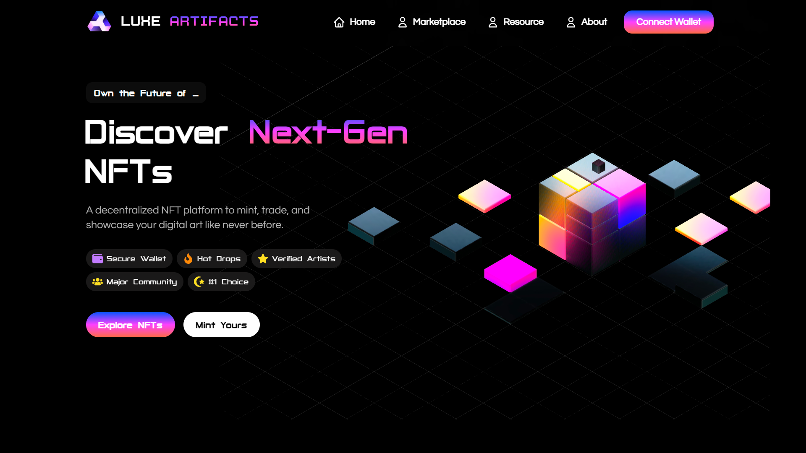

# Luxe Artifacts

<p align="center">
  
</p>

<p align="center">
  A bold NFT marketplace-inspired experience built with Next.js, React, and modern motion tooling.
</p>

<p align="center">
  
  
  
  
  
</p>

## Overview

Luxe Artifacts is a high-energy digital collectibles showcase with a polished NFT-marketplace aesthetic. The site blends immersive visuals, animated sections, and collector-focused UI to present a futuristic brand story centered on rarity, community, and digital ownership.

This project is built as a frontend-first Next.js application using the App Router. It includes a cinematic hero section, featured NFT discovery panels, collection highlights, creator showcases, a token mini-game, and polished layout components such as a custom header, preloader, and footer.

## Features

- Hero section with rotating Typewriter slogans and a Spline 3D scene
- Featured NFT discovery cards with live bid styling and collection stats
- Top collections and curated artifact showcase sections
- NFT selling / minting style CTA sections
- Creator network map with animated orbit-style markers
- Browse-more section with category filter styling
- Interactive NFT collector mini-game with upgrades and energy mechanics
- Fixed header with mobile drawer and scroll-to-top button
- Background audio and typing sound effects
- Custom preloader and optional custom cursor
- Scroll-based motion and polished transitions
- SEO assets including Open Graph image, sitemap, and manifest

## Tech Stack

- Next.js 15
- React 19
- Tailwind CSS 4
- Framer Motion
- GSAP
- AOS
- Spline
- MixItUp
- React Icons
- React Simple Typewriter
- SWR
- Recharts

## Main Sections

- Home hero with animated copy and 3D artwork
- Discover section for featured NFT listings
- Transaction section for marketplace trust and utility messaging
- Top collections leaderboard
- Featured collections gallery
- Sell NFTs call-to-action section
- More NFTs browsing section
- Steps / onboarding section
- Global creators network section
- NFT Collector mini-game and community callout

## Setup

### Prerequisites

- Node.js 18 or newer
- npm

### Install dependencies

```bash
npm install
```

### Run locally

```bash
npm run dev
```

Open `http://localhost:3000` in your browser.

### Production build

```bash
npm run build
npm start
```

## Project Structure

```text
luxe-artifacts/
├── README.md
├── LICENSE
├── banner.png
├── public/
│   ├── assets/
│   │   ├── audio/
│   │   ├── fonts/
│   │   └── images/
│   ├── favicon*.png
│   └── site.webmanifest
├── screenshots/
│   └── main.png
├── src/
│   ├── app/
│   │   ├── manifest.js
│   │   ├── opengraph-image.js
│   │   └── sitemap.js
│   ├── components/
│   ├── data/
│   └── styles/
├── next.config.mjs
├── package.json
├── postcss.config.mjs
└── eslint.config.mjs
```

## Screenshots


## License

This project is licensed under the MIT License. See [LICENSE](LICENSE) for details.


## Author
Ashish Kumar